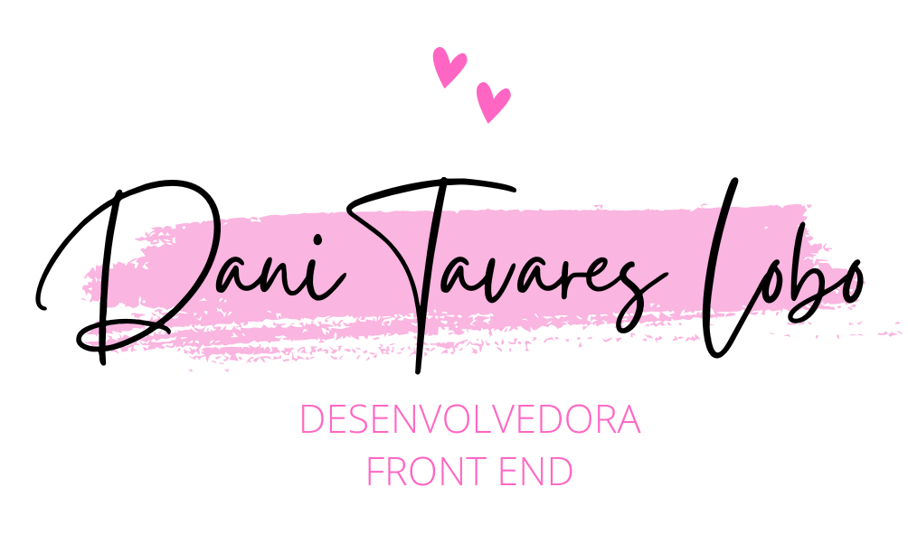

<h1  align="center"> Projeto ToDo (Lista de Tarefas) </h1>
<div align="center">

</div>
## Repositório para o Projeto ToDo 

Projeto ToDo:
O ToDo é uma Lista de Tarefas desenvolvido utilizando módulos e componentes. Utilizando um Forms básico, podendo alterar e remover itens. Estilização em CSS.
<br>
<br>

## Tecnologias Utilizadas
- `Figma`
- `HTML`
- `CSS`
- `TypeScript`
- `Angular`
- `Bootstrap`
- `Git / GitHub`

<br>


## Demonstração da Aplicação
<br>

https://github.com/danitavareslobo/ToDo/assets/107322230/823dbc20-4949-44b4-b2f5-7fdc004880a9

<br>

## Projeto Publicado

Vc pode acessar a Landing Page clicando aqui: :point_right: www.todo.danitavares.dev

<br>

## Acesso ao Projeto

Você pode acessar os arquivos do projeto clicando aqui: :point_right:  https://github.com/danitavareslobo/ToDo . 

Após baixar o projeto, você pode abrir o mesmo com Visual Code. 

Com o projeto aberto, execute o seguinte comando no terminal:

```sh
npm install
```
Abra o terminal na Pasta do Projeto e execute o comando abaixo para visualizar o projeto rodando:

```sh
ng serve --o
```

<br>

## Autoria do Projeto

| [<br><sub>Daniele Tavares Lobo</sub>](https://github.com/danitavareslobo) |
| :----: |
